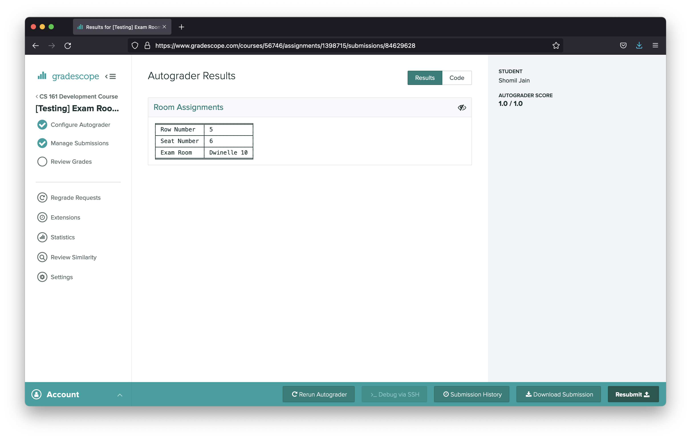
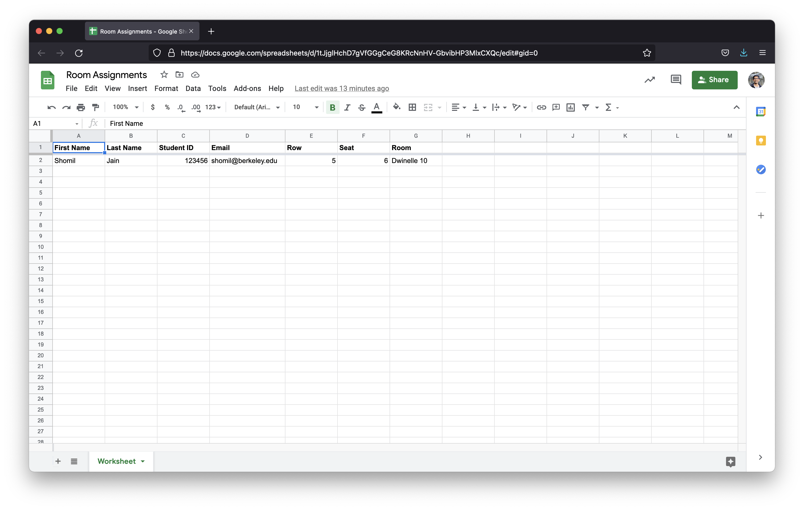

WIP Project for a Gradescope Frontend.

As of Sep 2024, this repo works for displaying Google Sheets data in a Gradescope autograder. (The `cached_sheets` feature is untested at the moment.)

[Here's some extra documentation for setting up the Google Sheets authentication if it helps.](https://docs.google.com/document/d/1Qi6SXin7vmHRc62UWIgUSd00r6ADiEaWo6Nki8Pf7Pg)

### Motivation
Often, we need a secure, private way to display persistent information to students based on their Student ID (e.g. exam room assignments, DSP accommodations, grades, etc.). Some large classes have built out infrastructure to achieve this goal, but for smaller classes, setting up & maintaining this infra requires a significant amount of overhead.

### Overview
This repository contains a lightweight Gradescope autograder that is designed to achieve the task described above. To install the base autograder, simply clone the repository & archive all files, and upload them as an autograder for a new Gradescope programming assignment.

Consider the following use case: we want a way to display exam room information to students. 

#### Student UI/UX
Students will upload a single file named "id.txt" containing their Student ID. Here's what they see:



#### Instructor UI/UX
This data for this use case lives in a Google Sheet, so we use the included Google Sheet utilities for this tool (see /engine/utils/sheets.py) to query data by student ID.

Here's what the spreadsheet looks like:


Here's what the code looks like. Notice how simple (and extensible!) it is:

```python
def generate(student_id: str, messenger: Messenger) -> None:

    # Look up room number & assignments using Google Sheets API
    record = fetch_student_record(
        credentials_dir='keys/',
        student_id=student_id,
        spreadsheet_url="example-spreadsheet-url",
        worksheet_index=0
    )

    rows = [['Row Number', record['Row']],
            ['Seat Number', record['Seat']],
            ['Exam Room', record['Room']]]

    messenger.log(tabulate(rows, tablefmt="fancy_grid"), section='Room Assignments')
```

### Security & Privacy Notes
- For additional security, the student-provided ID can be cross-referenced with the name or email provided by the Gradescope submission metadata.
- Google Sheets data remains secure through the use of service accounts.
